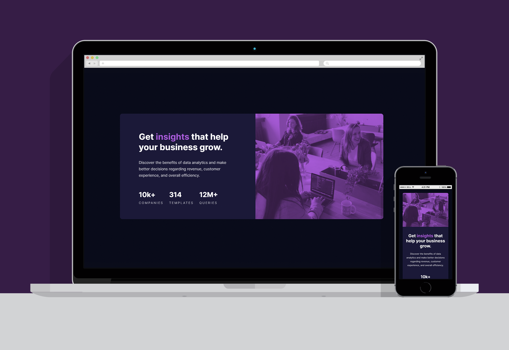

# | Stats Preview Card Component Challange
## This is a solution to the [Stats preview card component challenge on Frontend Mentor](https://www.frontendmentor.io/challenges/stats-preview-card-component-8JqbgoU62). 
### Project/Challange proposal: Users should be able to view the optimal layout depending on their device's screen size

<br><br>

# | Screenshots


<br>

# | Live View
- [Live Site Link](https://guilhermerera.github.io/stats-preview-card-component%20(html5%20css3%20js)/)
- [FrontEnd Mentor Solution](https://www.frontendmentor.io/solutions/html5-and-css3-section-TDKLPEujY)

<br>

# | What I learned
How to create a responsive section, thinking about mobile first. How to correctly use float, picture element and media query, avoiding excessive CSS codes. And also how to write a really cool README file. Tell me what you think of my code! :)


- The Picture Element was one of those "WOW MOMENTS" for me.
```html
<picture>
    <source srcset="./images/image-header-desktop.jpg"
        media="(min-width: 1440px)">
    
</picture>
```

<br>

# | Built With
    

<br>

# | Find Me
[](https://www.linkedin.com/in/guilherme-ferreira-6841b023/) [](mailto:guilhermerera@gmail.com) [](https://github.com/guilhermerera)